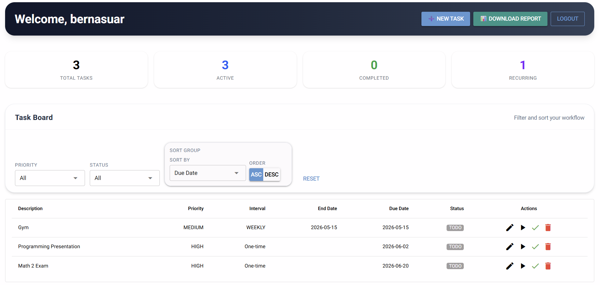
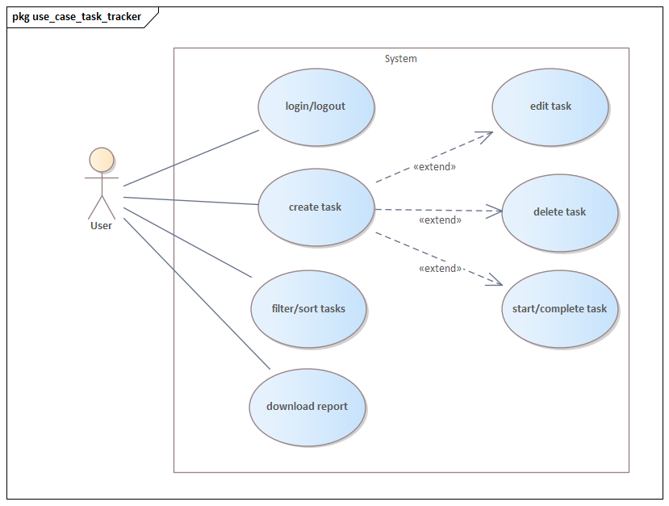
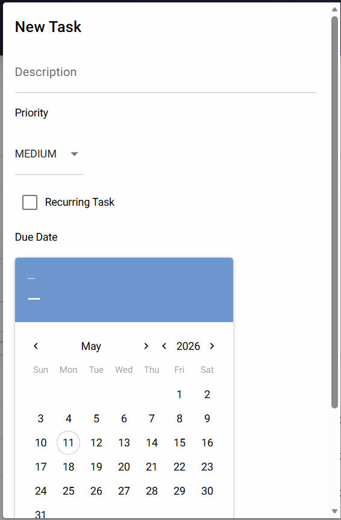
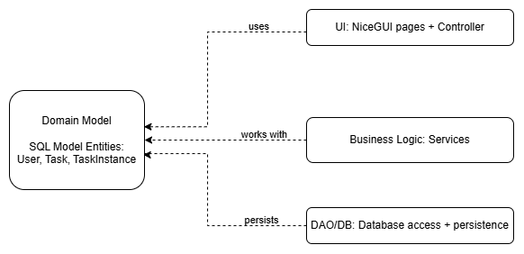
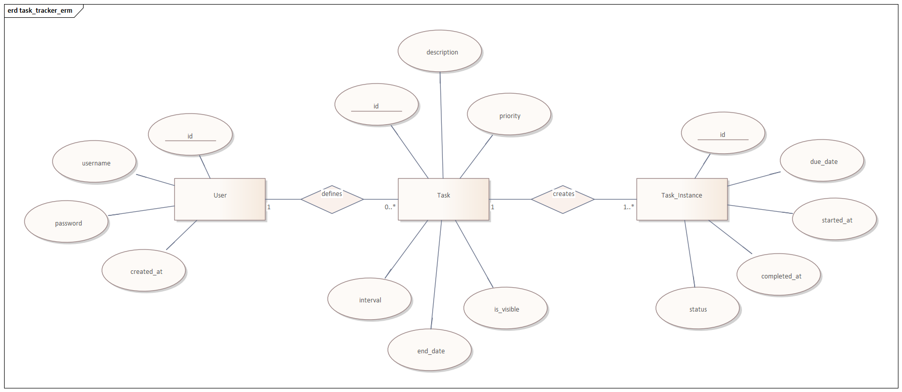

# 🌐 Task Tracker Web Pro



---

**Task Tracker Web Pro** is the full-stack evolution of our initial console-based application. Migrated for the **Advanced Programming** module, this version transforms a simple CLI into a modern, browser-based productivity suite. It leverages a professional software architecture featuring a dedicated frontend, backend, and persistent database layer.


---

## 🧐 Analysis & Context

### The Problem
Users often struggle to manage daily tasks because existing tools are either overly complex with overwhelming features or too simple, lacking secure data persistence. In the transition to advanced web applications, maintaining a clear separation of concerns between the user interface and the database becomes a critical challenge to ensure data integrity and security.

### Our Solution
**Task Tracker Web Pro** provides a professional three-tier web application that ensures scalability, privacy, and robust data management.

* **Integrated Web Interface:** Built with **NiceGUI**, the application runs as a thin client in the browser, while the UI state and components are managed securely as Python objects on the server.
* **Relational Persistence:** We have migrated from basic JSON storage to a robust **SQLite database**. Data is handled through an **Object-Relational Mapper (ORM)** to avoid direct SQL and ensure modularity.
* **Secure Access & Reporting:** The new version introduces a **Login System** for personalized task management and a **Reporting Module** to analyze productivity and download performance statistics.
* **Object-Oriented Architecture:** The backend utilizes modular Python units to organize business logic into self-contained, reusable components.
---

## 👥 User Stories
To ensure the application meets the needs of its end-users, the following requirements have been defined:

### 1. Secure Login
**As a user, I want to log in with my username and password so that I can securely view and manage my personal task list.**

- **Input:**
   * **Username:**
  <kbd>Username</kbd> : pro_user
  <kbd>Password</kbd> : password123
- **Output:**
   * **UI:** Redirects to the Dashboard and shows the user-specific task list, AuthService validates the hashed password and creates an active session.
---

### 2. Data Persistence
**As a user, I want my data to be automatically saved so that I never lose my progress.**

- **Input:** Any create, update, or delete action. 
- **Output:**
   * **UI:** Success notification (e.g., toast message).
   * **System:** The SQLModel session commits changes to the task_tracker.db file immediately.
---

### 3. Create New Tasks
**As a user, I want to create new tasks with descriptions and dates so that I can track responsibilities.**

- **Input:**
   * **Description:** Prepare for Statistics retake.
   * **Date:** 2026-06-25
- **Output:**
   * **UI:** New task card appears in the main dashboard view.
   * **System:** A new row is inserted into the Task table with a pending status.
---

### 4. Edit Existing Tasks
**As a user, I want to edit existing tasks so that I can update details as plans change.**

- **Input:** Task ID <kbd>int</kbd>, updated fields (description, date, or priority).
- **Output:**
   * **UI:** The task card reflects the new description without requiring a manual refresh.
   * **System:** <kbd>TaskService</kbd> updates the specific <kbd>Task_ID</kbd> in the database.
---

### 5. Delete Tasks
**As a user, I want to delete specific tasks so that I can remove irrelevant items.**

- **Input:**
   * **Action:** Click "Delete" on Task #101.
- **Output:**
   * **UI:** The task card is removed from the DOM.
   * **System:** The database record for Task #101 is deleted.
---

### 6. Cancel Action
**As a user, I want the option to cancel a current action to prevent accidental entries.**

- **Input:**
   * **Action:** Click "Cancel" button in the "New Task" modal.
- **Output:**
   * **UI:** Modal closes and clears all unsaved input fields.
   * **System:** No database session is opened; state remains unchanged.
---

### 7. Multi-Criteria Filtering
**As a user, I want to filter tasks by keywords and priority to focus on specific work.**

- **Input:**
   * **Search:** "Report".
   * **Filter:** "High Priority".
- **Output:**
   * **UI:** The task list updates instantly to show only matching tasks.
   * **System:** The app filters the database records to find tasks that contain the keyword AND match the selected priority.
---

### 8. Priority Assignment
**As a user, I want to assign priority levels to visually distinguish my work.**

- **Input:**
   * **Priority Select:** "Medium".
- **Output:**
   * **UI:** The task is styled with a distinct color-coded badge (e.g., Orange for Medium).
   * **System:** The <kbd>priority</kbd> attribute of the Task object is updated.
---

### 9. Deadline Tracking
**As a user, I want to create Deadline Tasks that flag themselves as "Overdue."**

- **Input:**
   * **Type:** "Deadline".
   * **Due Date:** Yesterday's date.
- **Output:**
   * **UI:** Task displays a prominent red "Overdue" badge.
   * **System:** A logical check <kbd>due_date < current_date</kbd> triggers the status update.
---

### 10. Task Recursion
**As a user, I want to create Recurring Tasks that renew themselves automatically.**

- **Input:**
   * **Task Type:** "Recurring".
   * **Action:** User marks task as "Completed."
- **Output:**
   * **UI:** The current instance disappears; a new instance appears for the next interval.
   * **System:** <kbd>TaskService</kbd> archives the old instance and instantiates a new <kbd>TaskInstance</kbd>.
---

### 11. Productivity Export
**As a user, I want a "Download Report" button to export statistics.**

- **Input:**
   * **Action:** Click "Download Report."
- **Output:**
   * **UI:** Browser initiates a download for <kbd>task_data.csv</kbd>.
   * **System:** <kbd>ReportService</kbd> generates a CSV file from the aggregated task data.
---


## Use Cases




   ## ✅ Automated Test Cases

   The repository includes an automated pytest suite targeted at three levels: unit, database (persistence), and integration tests. The test files are located in the `tests/` folder and use the shared fixtures in `conftest.py`.

   Test run summary: **14 passed** (executed via `pytest` in this workspace).

   Below are the 12 canonical test cases implemented in `tests/`, each presented as a table with the requested rows and updated with actual results.

### TC_001
| Field | Details |
| --- | --- |
| Test case ID | TC_001 |
| Test case title/description | _next_due_date computes correct offset for intervals |
| Preconditions | None (pure function) |
| Test steps | Call `_next_due_date(now, interval)` for Daily/Weekly/Monthly |
| Test data/input | `now = 2026-05-01T12:00:00`; `Interval = DAILY/WEEKLY/MONTHLY` |
| Expected result | `next_due - now == 1 day / 7 days / 30 days` respectively |
| Actual result | Pass (function returned expected offsets) |
| Status | Pass |
| Comments | Verified by automated unit test `test_next_due_date_intervals` |

### TC_002
| Field | Details |
| --- | --- |
| Test case ID | TC_002 |
| Test case title/description | _next_due_date raises on unsupported interval |
| Preconditions | None |
| Test steps | Call `_next_due_date(now, unsupported)` |
| Test data/input | `now`; `interval = object()` (unsupported) |
| Expected result | `ValueError` is raised |
| Actual result | Pass (ValueError raised) |
| Status | Pass |
| Comments | Verified by unit test `test_next_due_date_unsupported_raises` |

### TC_003
| Field | Details |
| --- | --- |
| Test case ID | TC_003 |
| Test case title/description | is_overdue returns True only for past, incomplete instances |
| Preconditions | None |
| Test steps | Create instances for past, equal-time, and completed; call `is_overdue(now)` |
| Test data/input | past `due_date = now - 1d`, equal `due_date = now`, completed `completed_at = now` |
| Expected result | overdue True for past incomplete; False for equal-time and completed |
| Actual result | Pass (behavior matches expectations) |
| Status | Pass |
| Comments | Verified by unit test `test_is_overdue_true_and_false` |

### TC_004
| Field | Details |
| --- | --- |
| Test case ID | TC_004 |
| Test case title/description | duration_seconds returns None for incomplete instances |
| Preconditions | None |
| Test steps | Create `TaskInstance` with no `started_at` or `completed_at`; call `duration_seconds` |
| Test data/input | instance with `started_at=None`, `completed_at=None` |
| Expected result | `duration_seconds` returns `None` |
| Actual result | Pass (returned `None`) |
| Status | Pass |
| Comments | Verified by unit test `test_duration_seconds_none_when_incomplete` |

### TC_005
| Field | Details |
| --- | --- |
| Test case ID | TC_005 |
| Test case title/description | duration_seconds computes positive and negative durations |
| Preconditions | None |
| Test steps | Create instances where `completed_at > started_at` and vice versa; call `duration_seconds` |
| Test data/input | `start=09:00 end=10:30` → expect `5400s`; reversed → expect `-5400s` |
| Expected result | Positive and negative durations computed correctly |
| Actual result | Pass (computed 5400s and -5400s) |
| Status | Pass |
| Comments | Verified by unit test `test_duration_seconds_positive_and_negative` |

### TC_006
| Field | Details |
| --- | --- |
| Test case ID | TC_006 |
| Test case title/description | is_overdue treats `due_date == reference` as not overdue |
| Preconditions | None |
| Test steps | Create `TaskInstance` with `due_date == now` and `completed_at=None`; call `is_overdue(now)` |
| Test data/input | `due_date == now` |
| Expected result | `is_overdue` returns `False` |
| Actual result | Pass (returned False) |
| Status | Pass |
| Comments | Verified by unit test `test_is_overdue_true_and_false` (equal-time case) |

### TC_007
| Field | Details |
| --- | --- |
| Test case ID | TC_007 |
| Test case title/description | init_schema allows DAO to create and retrieve records |
| Preconditions | Fresh `Database` fixture (provided by `conftest.py`) |
| Test steps | Use `UserDAO` to create a user; flush and refresh |
| Test data/input | `username="bob"`, `password="pass"` |
| Expected result | Created user has non-null id and can be retrieved by username |
| Actual result | Pass (user persisted and retrievable) |
| Status | Pass |
| Comments | Verified by DB test `test_init_schema_and_user_creation` |

### TC_008
| Field | Details |
| --- | --- |
| Test case ID | TC_008 |
| Test case title/description | DAOs can save `Task` and `TaskInstance` and retrieve them |
| Preconditions | Fresh `Database` fixture and baseline `user` fixture |
| Test steps | Create `Task` via `TaskDAO` and `TaskInstance` via `TaskInstanceDAO`; flush; query DAOs |
| Test data/input | `Task(description="DB test")`, `TaskInstance(due_date=now)` |
| Expected result | `Task` appears in `TaskDAO.get_tasks_by_user`; `TaskInstance` appears in `get_pending_instances` |
| Actual result | Pass (both Task and TaskInstance persisted and found) |
| Status | Pass |
| Comments | Verified by DB test `test_daos_save_and_retrieve` |

### TC_009
| Field | Details |
| --- | --- |
| Test case ID | TC_009 |
| Test case title/description | Database transaction rolls back on exception |
| Preconditions | Fresh `Database` fixture |
| Test steps | Within `session_scope` create a user then raise `RuntimeError`; catch outside; query for the user |
| Test data/input | `username="temp"` |
| Expected result | After exception, user is not persisted (`get_by_username` returns `None`) |
| Actual result | Pass (transaction rolled back) |
| Status | Pass |
| Comments | Verified by DB test `test_transaction_rollback_on_exception` |

### TC_010
| Field | Details |
| --- | --- |
| Test case ID | TC_010 |
| Test case title/description | create_task spawns the first `TaskInstance` |
| Preconditions | Fresh `Database` fixture and baseline `user` fixture |
| Test steps | Call `TaskService.create_task(...)`; then query `TaskInstanceDAO.get_pending_instances(task.id)` |
| Test data/input | `description="integ task"`, `due_date=now` |
| Expected result | Exactly one pending instance exists for the created task with same `due_date` |
| Actual result | Pass (one pending instance found matching due_date) |
| Status | Pass |
| Comments | Verified by integration test `test_create_task_spawns_instance` |

### TC_011
| Field | Details |
| --- | --- |
| Test case ID | TC_011 |
| Test case title/description | Completing a recurring task creates the next instance (parametrized) |
| Preconditions | Fresh `Database` fixture and baseline `user` fixture |
| Test steps | For each interval (Daily/Weekly/Monthly): create recurring task, call `mark_completed`, check returned next instance and `due_date` |
| Test data/input | `interval = DAILY/WEEKLY/MONTHLY`; `due_date=now` |
| Expected result | `mark_completed` returns a new `TaskInstance` with `due_date == _next_due_date(original_due, interval)` |
| Actual result | Pass (next instances created with correct due dates) |
| Status | Pass |
| Comments | Verified by integration test `test_mark_completed_creates_next_for_recurring` |

### TC_012
| Field | Details |
| --- | --- |
| Test case ID | TC_012 |
| Test case title/description | Completing a one-time task returns `None` (no next instance) |
| Preconditions | Fresh `Database` fixture and baseline `user` fixture |
| Test steps | Create one-time task (`interval=None`), call `mark_completed` |
| Test data/input | one-time task with `due_date=now` |
| Expected result | `mark_completed` returns `None` and no next pending instance is created |
| Actual result | Pass (function returned None for one-time tasks) |
| Status | Pass |
| Comments | Verified by integration test `test_mark_completed_one_time_returns_none` |


---

### Wireframes / Mockups




---
## 🏛️ Architecture



### Layers
The application is built using a **professional three-tier architecture** to ensure a clean separation of concerns:

- **UI Layer:** Built with **NiceGUI**, providing a browser-based interface where the UI state and components are managed securely as Python objects on the server.
- **Application Logic Layer:** Consists of **Controllers** and **Services**.
    - **Controllers:** Orchestrate the interaction between UI pages and backend services.
    - **Services:** Encapsulate business logic, such as `TaskService` for lifecycle management, `AuthService` for security, and `ReportService` for data exports.
- **Persistence Layer:** Utilizes **SQLite** combined with **SQLModel (ORM)** and the **Data Access Object (DAO)** pattern.

### Design Decisions
- **MVC Structure (Model–View–Controller):** A layered MVC variant is used to decouple user interactions from business objects, making the project easier to understand and test.
- **Clear Separation of Concerns:** Business logic in the Service layer remains independent of the UI components in the Page layer.
- **Relational Persistence:** Data management has been migrated to a robust SQLite database using an ORM to avoid direct SQL and ensure modularity.

### Design Patterns Used
- **Model-View-Controller / Layered MVC:** Ideal for applications with graphical interfaces and database access, ensuring that UI logic and domain logic are separated.
- **Facade Pattern:** Implemented in `db.py`, this pattern hides the technical details of database engine initialization and session management from the rest of the application.
- **Singleton Pattern:** The database connection and engine initialization follow a Singleton-like approach within `db.py`. This ensures that the application maintains a single, consistent point of access to the database engine, preventing redundant connections and resource leaks.


---

## 🗄️ Database and ORM



The application uses **SQLModel** to map domain objects to a local **SQLite** database. This approach allows for type-safe database interactions and seamless integration with the NiceGUI frontend.

### Entities
- **`User`**: Represents the system users, storing hashed credentials and profile information.
- **`Task`**: The core entity containing task descriptions, priority levels, and metadata.
- **`TaskInstance`**: Specifically for **Recurring Tasks**, these represent individual occurrences of a repeating task.

### Relationships
- **One `User` → many `Tasks`**: Each task is owned by exactly one user, ensuring data privacy and personalized lists.
- **One `Task` → many `TaskInstances`**: A single recurring task definition can generate multiple instances over time as they are completed.

---

## 📂 Repository Structure

 

```text
task_tracker_app/
├── __main__.py
├── application.py
├── data_access/
│   ├── __init__.py
│   ├── base_dao.py
│   ├── dao.py
│   └── db.py
├── models/
│   ├── __init__.py
│   └── enums.py
│   └── task.py
│   └── task_instance.py
│   └── user.py
├── services/
│   ├── __init__.py
│   ├── auth_service.py
│   ├── report_service.py
│   ├── task_service.py
└── ui/
    ├── __init__.py
    ├── controllers.py
    └── pages.py
```
---

### How to Run

### **1. Prerequisites**
 * Python 3.10+

### **2. Create & activate a virtual environment**
   - **macOS/Linux:**
      ```bash
      python3 -m venv .venv
      source .venv/bin/activate
      ```
   - **Windows:**
      ```bash
      python -m venv .venv
      .venv\Scripts\Activate
      ```

### **3. Install dependencies**
 ```bash
   pip install nicegui sqlmodel sqlalchemy pytest
   ```

### **4. Start the app**
 * Via python run the file __main__.py

###  5. Usage

1. Register/log in
2. Create a task
3. Edit or delete a task
4. Search and filter tasks
5. Complete tasks
6. Download a report

---

## 👥 Team & Contributions


| Name | Contribution |
| :--- | :--- |
| Bernardo Alfonso Suárez Espinoza | NiceGUI UI + documentation |
| Janusz Büeler | Business Logic + testing + documentation |
| Juan Vock | DataBase ORM + testing + documentation |
| Fernando Mauracher García | Controller + documentation |

---
